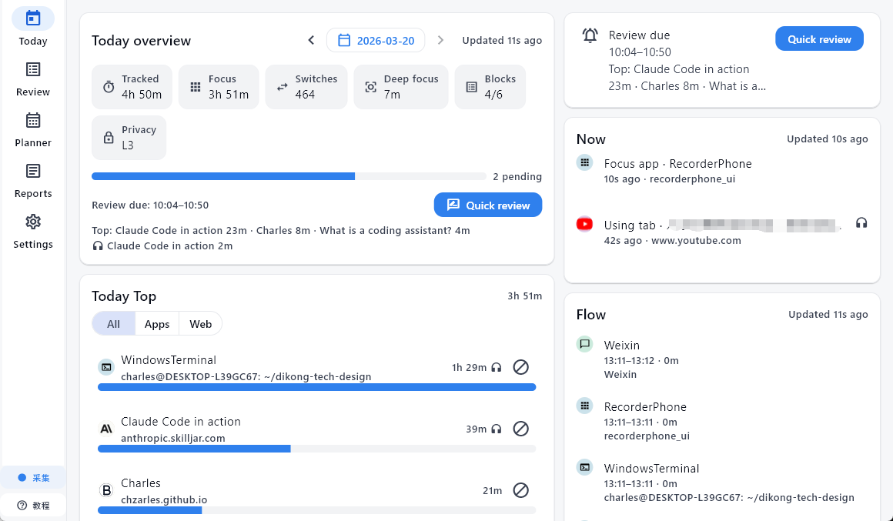
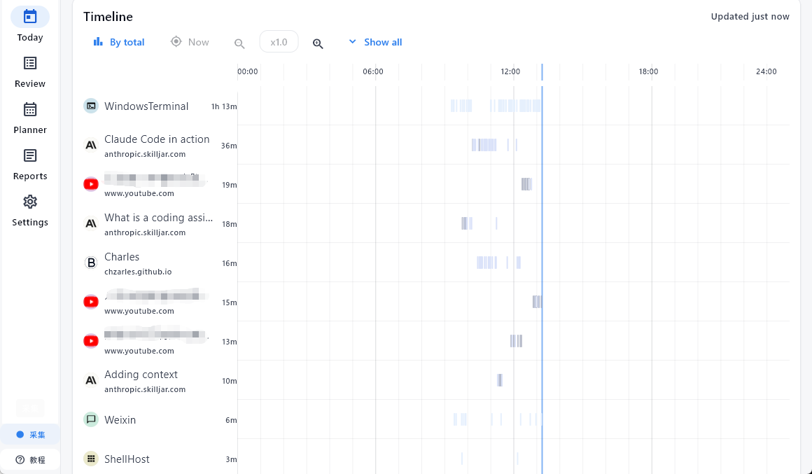
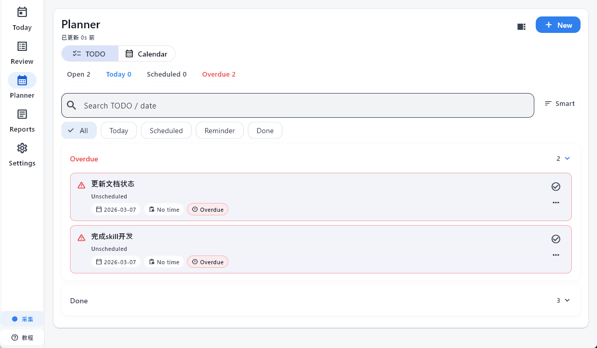
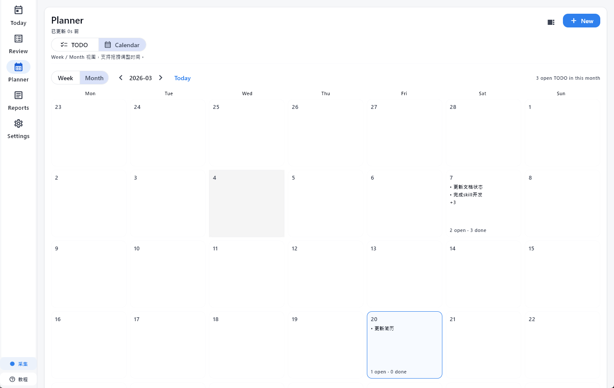

# WorkTrace

WorkTrace 是个给自己留工作痕迹的 Windows 桌面工具。它会把你当天的前台应用、浏览器活动和后台音频整理成时间块，方便你回看今天做了什么、补一条简短复盘，或者导出成日报材料。

如果你只想直接用，走 Windows 打包版就够了。安装后打开应用，它会尽量把本机的 Core 和 Windows Collector 一起拉起来；浏览器扩展是可选的，但装上之后网页记录会完整很多。

补一句避免混淆：文档里的示例仓库路径和默认数据目录现在都统一写成 `WorkTrace`。

## 这项目现在能做什么

- 记录 Windows 前台应用切换，按时间连续段聚合成 block
- 记录浏览器活跃标签页，默认保留域名；需要时也可以保存标题
- 记录后台音频来源，用来补足“虽然不在前台，但你确实在听”的那部分时间
- 在 `Today` 里看 `Now`、今日时间轴、Top 应用 / 域名、待复盘 block
- 在 `Review` 里给 block 写 `Doing / Output / Next`，加标签，或者直接跳过
- 在 `Planner` 里管理待办和日历视图
- 在 `Reports` 里生成日报 / 周报，支持手动生成，也支持按计划自动跑
- 在 `Settings` 里改隐私级别、提醒、导出、开机自启、更新和本机 Agent 控制
- 通过托盘菜单做常用动作，比如 `Quick Review`、暂停记录、恢复记录、打开数据目录

## 项目由哪些部分组成

正常使用时，主要是这四块在配合：

- `recorder_core`：本机 HTTP 服务，负责落库、聚合 block、时间轴、导出、报表和隐私规则
- `windows_collector`：采集 Windows 前台应用和后台音频
- `extension/`：Chrome / Edge 扩展，负责把浏览器活动发给 Core
- `ui_flutter/template/` 对应的桌面 UI：你平时看到的 `Today / Review / Planner / Reports / Settings`

默认链路很简单：

1. Collector 和扩展把事件发到 `http://127.0.0.1:17600/event`
2. Core 把事件写进本地 SQLite
3. 桌面 UI 再从 Core 读取 `Now`、今日 block、时间轴、报表和设置

## 最常见的用法

### 1. 直接安装 Windows 版

去 GitHub Releases 下载并运行最新的安装包：

- `WorkTrace-<tag>-windows-setup.exe`

默认安装目录：

- `%LOCALAPPDATA%\\Programs\\WorkTrace`

默认数据目录：

- `%LOCALAPPDATA%\\WorkTrace\\recorder-core.db`

### 2. 第一次打开后先做这几件事

- 打开应用，确认 `Server URL` 还是默认的 `http://127.0.0.1:17600`
- 去 `Settings` 看一眼 `Desktop agent (Windows)`，确认 Core / Collector 能正常启动
- 如果你希望登录后就开始记，打开 `Start with Windows`
- 如果你想记录网页，把 `extension/` 目录加载成 Chrome / Edge 的已解压扩展

扩展默认把事件发到：

- `http://127.0.0.1:17600/event`

扩展 popup 里可以直接点 `Test /health`，用来确认链路通不通。

### 3. 平时怎么用

一个比较接近真实使用的流程是这样：

1. 上班后把 WorkTrace 挂着，不用一直看它
2. 正常切应用、开网页、放后台音频，系统会持续记
3. 有 block 到点但还没复盘时，`Today` 和托盘都会给出入口
4. 在 `Review` 里补几句 `Doing / Output / Next`，或者标记 `Skip`
5. 到晚上如果想回顾当天，可以去 `Reports` 生成日报，或者在 `Settings` 里导出 markdown / csv

## 界面截图

### Today 总览

这张图基本把首页最常用的信息放在一起了。左上是今天的总览卡片，能直接看到累计时长、聚焦时长、切换次数、深度工作时长、已经复盘了多少 block。右上角会单独给出 `Review due`，不用翻页就能进快速复盘。右侧的 `Now` 和 `Flow` 更适合拿来回答两个问题：你现在在干什么，刚才又切到了哪里。下面的 `Today Top` 则是按应用和网站把今天的时间分布拉出来，适合回看“时间到底花在哪了”。

### Timeline

Timeline 适合看一天的节奏，而不是只看汇总。左边是今天出现过的应用 / 网站列表，右边是从 `00:00` 到 `24:00` 的时间轴。你能很直观地看出某个工具是持续用了很久，还是零散地反复切回来。对需要复盘的人来说，这一页的价值在于它不是只告诉你“今天用了 1 小时”，而是把这 1 小时分布在什么时候摊开给你看。

### Planner 的 TODO 视图

Planner 里的 TODO 视图更像是把“要做的事”和“已经发生的记录”放到同一套工作流里。这里能按 `Open / Today / Scheduled / Overdue` 切，也能直接搜任务名或日期。截图里能看到逾期任务会单独收在 `Overdue` 下面，视觉上也会更醒目，所以你一眼就能先处理拖着没做的事情。

### Planner 的 Calendar 视图

如果你更习惯按日期看事，就会更常用 Calendar 这一页。它支持周 / 月切换，适合看某一天塞了多少任务，或者某一周是不是已经排得太满。和 TODO 列表比起来，Calendar 的好处是更容易看出“这件事该放在哪天”以及“哪些天已经挤在一起了”。

## 主要页面

### Today

这里是每天最常看的页面，主要看三类信息：

- `Now`：你现在正在用什么
- `Today overview` / `Today Top`：今天主要时间花在哪些应用和站点
- `Timeline`：从 `0:00` 到现在的时间轴，能点条形段回到对应 block

如果有待复盘的 block，这里也会直接给你 `Quick Review` 入口。很多时候你不需要先进 `Review` 页面，首页就已经够你做一轮快速回顾了。

### Review

`Review` 是按天看的 block 列表。你可以：

- 按关键词筛选
- 只看待处理 / 已复盘 / 已跳过
- 打开 block 详情
- 直接写快速复盘
- 把应用或域名加入隐私规则 / 黑名单

### Planner

`Planner` 在同一套报表页面里，主要是待办和日历视图。可以看今天、过期、未排期的事项，也可以调整计划日期。它更像是把“复盘之后下一步要做什么”接住，不让记录只停在回顾。

### Reports

`Reports` 用来处理日报 / 周报相关的事，包括：

- 手动生成日报、周报
- 设定自动生成时间
- 管理报表相关的 TODO
- 查看已生成的报告
- 配置 OpenAI-compatible 报表连接和提示词

如果你不配云端模型，WorkTrace 仍然可以记录、复盘、导出；只是自动生成这类报告能力不会工作。

### Settings

`Settings` 里东西比较全，日常最常碰到的是这些：

- `Server URL`
- `Desktop agent (Windows)` 的启动 / 重启 / 停止
- `Review reminders`
- 隐私等级和隐私规则
- `Start with Windows`
- `Updates`
- 导出 markdown / csv
- 删除某一天数据，或者清空全部数据

## 隐私和数据

WorkTrace 的数据默认是本地的，核心数据在 SQLite 里。

隐私控制分三层：

- `L1`：只保存应用 / 域名和时长
- `L2`：允许保存窗口标题 / 标签页标题
- `L3`：允许保存 `exePath`

另外你还能手动加隐私规则，按应用或域名丢弃记录。

有一点最好提前知道：

- 不装浏览器扩展，你仍然能记录 Windows 应用和后台音频
- 装了扩展，网页维度才会更完整
- 开了 `L2`，你才会在部分页面看到更细的标题信息
- 报表生成功能可以接 OpenAI-compatible 服务，但这不是基本记录流程的前提

## 托盘和提醒

WorkTrace 支持托盘常驻。托盘菜单里可以直接做这些动作：

- `Open / Hide`
- `Quick Review`
- `Pause`
- `Resume`
- `Open app folder`
- `Open data folder`
- `Exit`

Windows 采集器也会按 block 到点情况发提醒，并支持通过 `worktrace://` 深链把动作带回桌面 UI。

## 如果你想从源码跑

普通使用者可以跳过这一节。开发入口在这些文档里：

- `DEVELOPING.md`：仓库结构和开发入口
- `WINDOWS_DEV.md`：WSL / Windows 联调、UI 覆盖、Collector / Core 运行方式
- `ui_flutter/README.md`：Flutter UI 模板的使用方式
- `RELEASING.md`：Windows 打包和 GitHub Releases 发布流程

## 仓库里你会看到什么

几个主要目录：

- `core/`：Rust Core
- `collectors/`：Windows Collector
- `extension/`：浏览器扩展
- `ui_flutter/`：Flutter 桌面 UI 模板
- `dev/`：开发、联调、打包脚本
- `schemas/`：事件 schema

如果你的目的只是“装上就用”，不需要把这些目录一个个看完。先装打包版，再按上面的最短流程跑一遍，基本就够了。
